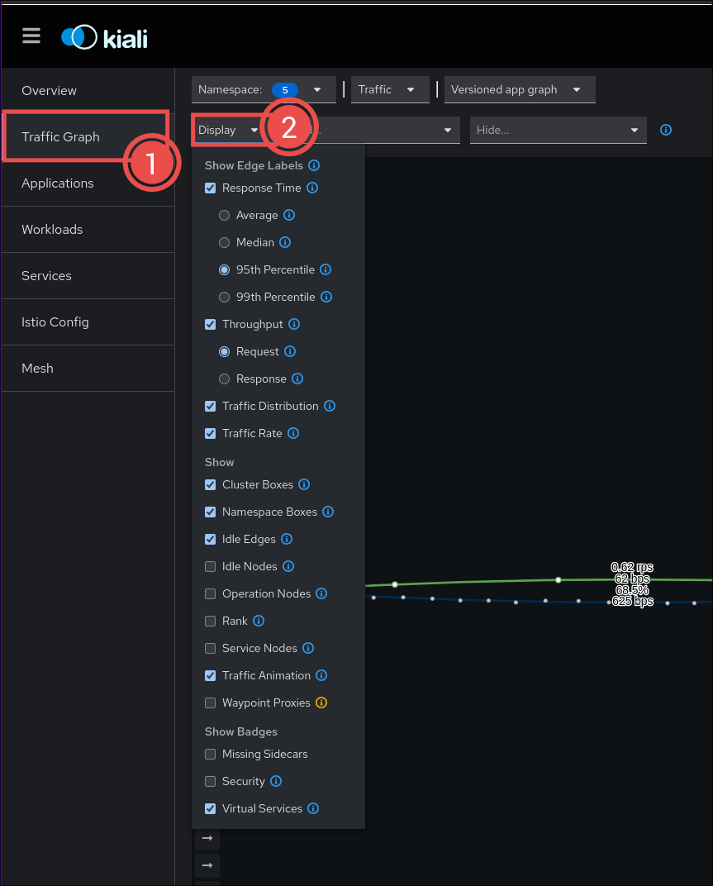

# Demo

We use `devbox` to install the required tooling for the setup, such as:

- `vault`
- `k3d`
- `kubectl`
- `istioctl`
- `helm`
- `terraform`
- `fluxcd`
- `jq`

You an initialise these tools by running `devbox shell`. This might take a while initially, but
subsequent runs should be very fast.

## Setup

### Generate a GitHub PAT

See the documentation: https://docs.github.com/en/authentication/keeping-your-account-and-data-secure/managing-your-personal-access-tokens

For fined-grained control, grant the token Content read/write permissions on the repository.

### Setup the Cluster

In order to setup your cluster, run:

```bash
# run terraform script
cd terraform
terraform init

export TF_VAR_github_token="<redacted>"

# create k3d cluster
terraform apply -target=module.k3d_cluster

# create everything else
terraform apply
```

This will slowly bootstrap the entire infrastructure according to a dependency tree. Wait for the
following command to return a pod to ensure most of the infrastructure is ready:

```bash
kubectl get pods -n infra-gateway-system -l service.istio.io/canonical-name=prod-gateway-istio
```

To ensure the app is also ready, ensure the following command also returns a pod (might take up to
5-10 minutes, depending on your internet connection to pull images):

```bash
kubectl get pods -n httpbin
```

### Access

Change your `/etc/hosts` file to contain an entry for routing traffic to the cluster:

```
127.0.0.1 kiali.apps.example.com httpbin.apps.example.com
```

You can then access Kiali via `kiali.apps.example.com:8080` in your browser.

Generate some load on `httpbin` to see it in Kiali:

```bash
while true; do
   curl http://httpbin.apps.example.com:8080/headers
   sleep 1s
done
```

In Kiali, select the following options, and you will see the traffic appear:



### Cleanup

You can cleanup the setup using the following commands:

```bash
k3d cluster delete gateway-demo
docker rm vault
```
